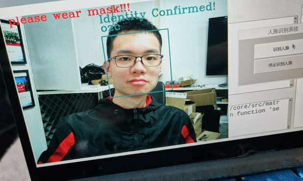
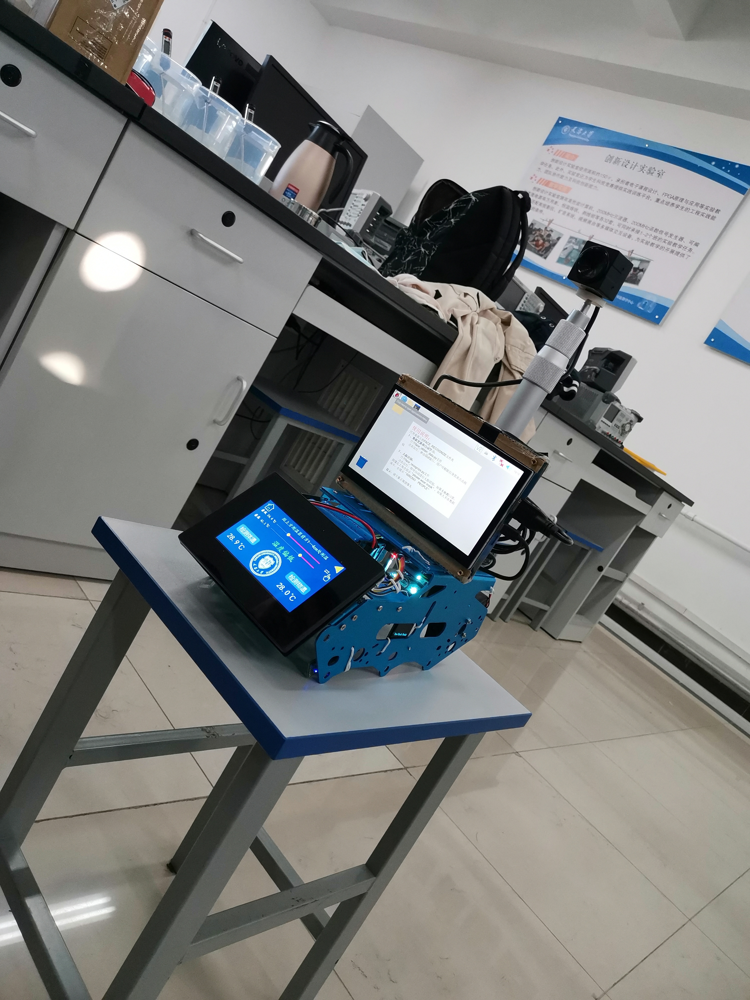
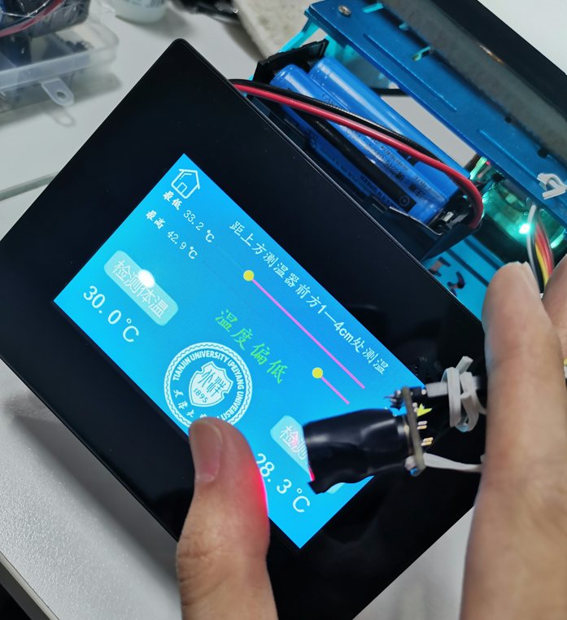

# 2020 TI杯电子设计大赛








# 人脸检测
人脸检测的检测方法主要有两类:基于知识(根据眼睛,眉毛,嘴巴,鼻子等器官特征及相互几何位置关系来检测)和基于统计(将人脸看作一个二维像素矩阵,通过大量人脸图像样本构造人脸模式空间,由相似度量判断人脸是否存在).
> 基于知识的检测
> - 模板匹配
> - 人脸特征
> - 形状边缘
> - 纹理特征
> - 颜色特征

> 基于统计的检测
> - 主成分分析与特征脸
> - 神经网络方法
> - 支持向量机
> - 隐马尔可夫模型
> - Adaboost算法

> 分类
> - 对已知物体类别总数的识别方式,训练时数据就带有标签,明确是人脸还是非人脸,称为有监督学习.

> 聚类
> - 处理类别总数不确定的方法或训练的数据无标签,无需学习阶段中关于物体类别的信息,成为无监督学习.

# Haar分类器
> Haar分类器=Har-like特征+积分图方法+AdaBoost+级联
> - 使用Haar-like特征做检测
> - 积分图对Haar-like特征求值加速
> - 使用AdaBoost算法训练区分人脸与非人脸的强分类器
> - 使用筛选式级联把强分类器级联,提高准确率


## Haar-like特征
在人脸检测时需要有一个子窗口在待检测的图片窗口中不断的移位滑动，子窗口每到一个位置，就会计算出该区域的特征，再用训练好的级联分类器对该特征进行筛选，当这个特征通过了所有强分类器的筛选，就判定这个区域为人脸。


上面的方块都是Haar-like特征,将上面的任意一个矩形放到人脸区域上，然后，将白色区域的像素和减去黑色区域的像素和，得到的值为人脸特征值，如果把这个矩形放到一个非人脸区域，那么计算出的特征值应该和人脸特征值是不一样的，而且越不一样越好，所以这些方块的目的就是把人脸特征量化，以区分人脸和非人脸。

比如对于人脸区域,比较明显的两个特征是眼睛比面部和鼻梁区域颜色都要深.


为了增加区分度,对多个矩形特征计算得到区分度更大的特征值,寻找何种矩形何种特征就是AdaBoost的任务.

## AdaBoost算法
AdaBoost是一种有一般性的分类器提升算法,可以帮助选择更好的矩阵特征组合,也就是分类器,将矩阵组合以二叉决策树的形式存储起来.

> 弱学习
> - 一个学习算法对一组概念的识别率只比随即识别好一点
> - 容易获得,需要大量假设集合(基于某些简单规则的组合和对样本集的性能评估生成的)

> 强学习
> - 一个学习算法对一组概念的识别率很高
> - 不容易获得的

Kearns和Valiant两位大牛牛提出了弱学习和强学习等价的问题,证明只要有足够数据,弱学习方法可通过集成方式生成任意高精度的强学习方法.

弱分类器和强分类器对应的就是弱学习与强学习.

### 弱分类器
最初的弱分类器可能只是一个最基本的Haar-like特征，计算输入图像的Haar-like特征值，和最初的弱分类器的特征值比较，以此来判断输入图像是不是人脸，但这个弱分类器太简陋了，可能并不比随机判断的效果好，对弱分类器的孵化就是训练弱分类器成为相对误差稍低的最优弱分类器.

> 决策树
> - 一个预测模型
> - 代表对象属性与对象值的一种映射关系
> - 分类树: 预计结果可能为两种类型
> - 回归树: 局域结果可能为实数

假设使用三个Haar-like特征f1,f2,f3判断输入数据是否为人脸,可建立决策树


每个非叶子节点表示一种判断,每个路径代表一种判断的输出,每个叶子节点代表一种类别,作为最终判断结果.一个弱分类器是一个基本与上图类似的决策树,最基本的弱分类器只含一个Haar-like特征,即决策树仅一层,称为树桩。

最重要的就是如何决定每个结点判断的输出，要比较输入图片的特征值和弱分类器中特征，一定需要一个阈值，当输入图片的特征值大于该阈值时才判定其为人脸。训练最优弱分类器的过程实际上就是在寻找合适的分类器阈值，使该分类器对所有样本的判读误差最低。

### 强分类器
强分类器的诞生需要T轮迭代

1. - S: 训练样本集
   - N: 样本数量
   - X: 正样本
   - Y: 负样本
   - T: 最大循环数量
   - 1/N: 初始化样本权重,训练样本的初始概率分布
2. 第一次迭代训练N个样本,得到一个最优弱分类器
3. 提高上一轮被误判样本权重
4. 新的样本和上次分错样本放在一起进行新一轮训练
5. 循环执行4-5步,T轮后得到T个最优弱分类器
6. 组合T个最有弱分类器得到强分类器,让所有弱分类器投票，再对投票结果按照弱分类器的错误率加权求和，将投票加权求和的结果与平均投票结果比较得出最终的结果

## 级联
通过AdaBoost算法训练出了强分类器，但在现实的人脸检测中，只靠一个强分类器还是难以保证检测的正确率，需要训练出多个强分类器将它们强强联手，最终形成正确率很高的级联分类器,即最终的目标Haar分类器。

 

输入图片输出大量的子窗口图像，这些子窗口图像经过筛选式级联分类器会不断地被每一个节点筛选，抛弃或通过, 这个结构也是一个决策树。

级联强分类器的策略是，将若干个强分类器由简单到复杂排列，希望经过训练使每个强分类器都有较高检测率，而误识率可以放低，比几乎99%的人脸可以通过，但50%的非人脸也可以通过，这样如果有20个强分类器级联，那么他们的总识别率为 $0.99^{20}=98\%$ ，错误接受率也仅为$0.5^{20}=0.0001\%$。这样的效果就可以满足现实的需要了，但是如何使每个强分类器都具有较高检测率呢，为什么单个的强分类器不可以同时具有较高检测率和较高误识率呢？

AdaBoost训练出来的强分类器一般具有较小的误识率，但检测率并不很高，一般高检测率会导致高误识率，这是强分类阈值的划分导致的，要提高强分类器的检测率既要降低阈值，要降低强分类器的误识率就要提高阈值，这是个矛盾的事情。而增加分类器个数可以在提高强分类器检测率的同时降低误识率，所以级联分类器在训练时要考虑如下平衡，一是弱分类器的个数和计算时间的平衡，二是强分类器检测率和误识率之间的平衡。

# OpenCV
OpenCV是计算机视觉中经典的专用库，其支持多语言、跨平台，功能强大。OpenCV-Python为OpenCV提供了Python接口，使得使用者在Python中能够调用C/C++，在保证易读性和运行效率的前提下，实现所需的功能。
[安装教程](http://www.woshicver.com/)

# OpenCV的Haar级联分类器
OpenCV提供了一种训练方法或预先训练的模型，可以在OpenCV安装的`\opencv\sources\data\haarcascades_cuda`文件夹中找到, 可以使用`cv2.CascadeClassifier(~)`方法读取。

先用OpenCV开启笔记本默认摄像头
```python
import numpy as np
import cv2
cap = cv2.VideoCapture(0) # 打开笔记本摄像头
while 1:
    ret,frame = cap.read() # 获取拍摄的图像
    cv2.imshow("picture",frame)
    if cv2.waitKey(1) == 27: # 按下esc停止
        break
cv2.destroyAllWindows() # 关闭所有窗口
```
文件夹里有很多分类器, 这里用的是`haarcascade_frontalface_default.xml`正脸检测分类器.

## 人脸检测
参考文件`FaceFind.py`

```python
# 加载级联分类器
face_cascade = cv2.CascadeClassifier('haarcascade_frontalface_default.xml') 
```
用`face_cascade.detectMultiScale`可以对输入的灰度图检测, 返回的是一个列表, 列表的元素是人脸所在矩形区域的左上角坐标和宽高, 获取之后我们在原图像上画出来,这里先把检测和画图封装成函数.
```python
# 人脸检测函数
def detect_face(img):
    # 将测试图像转换为灰度图像，因为opencv人脸检测器需要灰度图像
    gray = cv2.cvtColor(img, cv2.COLOR_BGR2GRAY)
    # 检测多尺度图像，返回值是一张脸部区域信息的列表（x,y,宽,高）
    faces = face_cascade.detectMultiScale(gray, scaleFactor=1.2,minNeighbors=5,minSize=(20, 20)) #人脸的最小范围，如果比20*20像素小忽略)
    # 如果未检测到面部，则返回原始图像
    if (len(faces) == 0):
        return None, None 
    # 目前假设只有一张脸，xy为左上角坐标，wh为矩形的宽高
    (x, y, w, h) = faces[0]
    # 返回图像的正面部分
    return gray[y:y + w, x:x + h], faces[0]

# 根据给定的（x，y）坐标和宽度高度在图像上绘制矩形
def draw_rectangle(img, rect):
    (x, y, w, h) = rect # 矩形跟踪人脸
    cv2.rectangle(img, (x, y), (x + w, y + h), (255, 128, 0), 2)
    cv2.rectangle(img, (x+2, y+2), (x + w-2, y + h-2), (0, 255, 128), 2)
```
然后在while循环的获取图像后加上
```python
try:
    face, rect = detect_face(frame) # 寻找可以识别人脸的图片
    draw_rectangle(frame, rect) # 框选人脸
except: # 未能识别到人脸
    print("no face")
```


## 模型训练
参考文件`FaceTrain.py`

知道哪一个区域是人脸后, 下一步就是分辨人脸是谁了, OpenCV也提供了方便的工具, 先录入图片, 创建识别器, 训练得到模型并保存.

```python
# 创建两个列表分别保存所有的脸部和标签
faces = []
labels = []
Names = ["Trump", "Putin", "TrumpTin"]
NameNumber = 2 # 1Trump2Putin
```

输入参数是人脸图片和标签(正整数123), 一般录入人脸是输入姓名, 但姓名其实也是对应整数标签, 这里偷一下懒, 用`NameNumber`指代姓名, 检测时再用标签对应到名字数组.

在框选到人脸之后添加, 每次训练都是创建一个新模型, 覆盖掉原来的模型, 所以举例的代码得到的模型只能分辨到一张人脸.
```python
if face is not None:
    #将脸添加到脸部列表并添加相应的标签
    faces.append(face)
    labels.append(NameNumber)
    times += 1
    print(times)
if times > 15:
    # 创建LBPH识别器并开始训练，当然也可以选择Eigen或者Fisher识别器
    face_recognizer = cv2.face.LBPHFaceRecognizer_create()
    face_recognizer.train(faces, np.array(labels))
    # 保存训练好的模型
    face_recognizer.save("face_model.xml")
    break   
```


## 人脸预测
参考文件`FaceDectect.py`

训练得到的是xml后缀的文件, 在检测程序里先加载为`face_recognizer`
```python
# 加载已训练的模型
def Load_face_model():
    face_recognizer = cv2.face.LBPHFaceRecognizer_create()
    try:
        face_recognizer.read("face_model.xml")
        return face_recognizer
    except:
        print('No Module, please obtain first')
        noi = 1
        return noi
face_recognizer = Load_face_model()
Names = ["Trump", "Putin", "TrumpTin"]
```

创建预测函数, 用`face_recognizer.predict(face)`对`detect_face`出的面部区域进行预测, 可以得到一个结果列表`label[2]`, 其中`label[0]`是预测的标签, 如果正确就是上一节输入的标签`NameNumber`, `label[1]`是预测输入的图像与这个标签的正确度, 越小正确度越高, 这里我们取小于70认为是正确, 并用标签`label[0]`映射回姓名列表, 在图片上写出姓名, 如果否, 就写上陌生人stranger.

```python
# 此函数识别传递的图像中的人物并在检测到的脸部周围绘制一个矩形及其名称
def predict(test_img):
    #生成图像的副本，这样就能保留原始图像
    img = test_img.copy()
    #检测人脸
    face, rect = detect_face(img)
    try:
        #预测人脸
        label = face_recognizer.predict(face)
        print(label)
        # 在检测到的脸部周围画一个矩形
        draw_rectangle(img, rect)
        if label[1]<70:
            # 获取由人脸识别器返回的相应标签的名称
            label_text = Names[label[0]-1]
            # 标出预测的名字
            draw_text(img, label_text,  rect[0], rect[1] - 15, "WHITE")
        else:
            # 未识别，wrong people
            draw_text(img, "Stranger",  rect[0], rect[1] - 5, "RED")
    except Exception as err:
        print(err)
    #print(label)   
    #返回预测的图像
    return img
```

`while 1`里的检测改为

```python
try:
    predicted_img = predict(frame)
except: # 未能识别到人脸
    print("no face")
```

例子里的代码每次训练都是创建一个新模型, 覆盖掉原来的模型, 程序就结束了, 所以举例的代码得到的模型只能分辨到一张人脸. 如果要识别多个人脸, 可以运行gui控件, 根据不同操作持续添加人脸数据, 或者每次都把不同人的图片存下来, 训练时统一调用训练.


# 口罩检测
类似的原理可以训练出检测是否佩戴口罩的模型
```python
mask_cascade = cv2.CascadeClassifier('no_mask_detect_cascade.xml')
```

```python
# 检测是否佩戴口罩
def detect_facemask(img):
    # 将测试图像转换为灰度图像，因为opencv人脸检测器需要灰度图像
    gray = cv2.cvtColor(img, cv2.COLOR_BGR2GRAY)
    # 检测多尺度图像，返回值是一张脸部区域信息的列表（x,y,宽,高）
    faces = face_cascade.detectMultiScale(gray, scaleFactor=1.2,
        minNeighbors=5,minSize=(50, 50)) #人脸的最小范围，如果比20*20像素小忽略
    # 如果未检测到面部，则返回原始图像
    if (len(faces) == 0):
        return None, None, None
    # 目前假设只有一张脸，xy为左上角坐标，wh为矩形的宽高
    (x, y, w, h) = faces[0]
    no_mask = mask_cascade.detectMultiScale(gray[y:y + w, x:x + h],
        scaleFactor  = 1.01, minNeighbors = 4)
    # 返回图像的正面部分
    return gray[y:y + w, x:x + h], faces[0], no_mask
```

# 红外测温
如果用的是树莓派, 可以比较方便地用杜邦线接入mlx90614等红外测温模块.


模块用smbus协议通讯, 附件中有现成的接口`mlx90614.py`, 直接调用即可.

上面这些东西组合起来, 其实是2020年电子设计大赛的赛题


> 参考
> - [浅析人脸检测之Haar分类器方法](https://www.cnblogs.com/ello/archive/2012/04/28/2475419.html)
> - [图像特征提取三大法宝：HOG特征，LBP特征，Haar特征](https://blog.csdn.net/jscese/article/details/52954208)
> - [级联分类器](http://www.woshicver.com/Eleventh/10_1_%E7%BA%A7%E8%81%94%E5%88%86%E7%B1%BB%E5%99%A8/)
> - [Viola–Jones object detection framework--Rapid Object Detection using a Boosted Cascade of Simple Features中文翻译 及 matlab实现(见文末链接)](https://www.cnblogs.com/wjgaas/p/3618557.html)

关注公众号**小电动车**


回复**人脸识别**获取代码